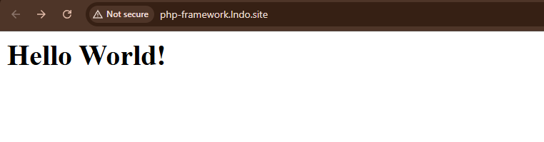
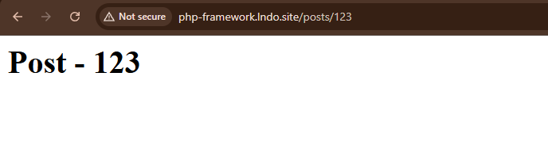

### SMALL PHP FRAMEWORK WRITTEN IN PURE PHP

## Features
1. MVC structure (view not implemented)
2. PSR-4 autoloading
3. Simple routing using FastRoute
4. Custom HTTP Request and Response classes
5. Ready to run with Lando or PHP server

## Technologies
PHP 8.2
Composer
FastRoute
Lando

## Quick start
1. Clone the repo
```text
git clone https://github.com/Tesemir/php-framework
```
2. Install dependencies
```text
composer install
```
3. Start Lando
```text
lando start
```

## Example Output

